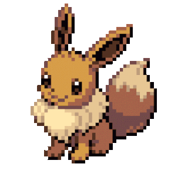

## Hi, I'm Raniery

<!--About me-->
- 📚 I'm currently learning `Java`, `HTML`, `CSS` and `JavaScript`
- 👨🏻‍💻 I dont know why, but I'm very interested in Ruby
- 🕹 In my free time I like to play games, read and listen music

<!--Github stats-->

<!--Toggle lists-->

    
 ⚜ Language and tools 
 
        <h3>Languages</h3>
        
   
   
   
   
   
   
    <h3>Databases and frameworks</h3>
    
   
   
   
    
   
    
   
   
    <h3>Softwares and tools</h3>
   
   
   
   
   
     
    <!--https://simpleicons.org/-->

    
 💻 More Github stats

     
    

    
    
    

    
 🚀 Current projects 
 
    

        
        <a class='game'
        href="https://github.com/Ranieeery/Game-indev-Java">
</a>
     

## 

      
    
    
    

<!--idk how to name this-->

  
  

<h2>
    ✨ Thanks for your attention ✨</h2>

