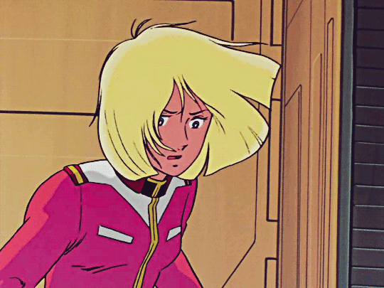

    <h1>Olá, me chamo Raniery 👋!</h1>

### $\textcolor{orange}{\textsf{Desenvolvedor Fullstack e aspirante a gamedev}}$

 

### ` </> Raniery.exe           🗕 🗗 🗙 `

- Atualmente trabalhando na Empresa1

- Aprendendo `Java`, `SQL` e `C`

- Ciência da Computação: $\textcolor{lightgreen}{\textsf{( 5/8 )}}$

- Jogos, livros e anime

- Línguas **PT / EN / JP**

- [E-mail](mailto:raniery2003@hotmail.com) • [LinkedIn](https://www.linkedin.com/in/ranierygoulart/)

<h3>Linguagens e ferramentas:</h3>

<!-- ### ` </> Raniery.exe           🗕 🗗 🗙`

$\textcolor{lightgreen}{\textsf{github@raniery: }}
\textcolor{white}{\textsf{find -name "README.md"}}$  
$\textcolor{white}{\textsf{./.github/README.md}}$  
$\textcolor{lightgreen}{\textsf{github@raniery: }}
\textcolor{white}{\textsf{cat ./.github/README.md}}$ -->

<!-- 

aaaa

aaaa

 -->